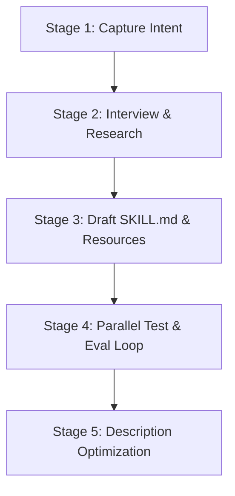

# Agent Skill Creator (`agent-skill-creator`)

A master skill for authoring, evaluating, benchmarking, and optimizing Agent Skills following the open **Agent Skills Specification** (`agentskills.io`) adopted by Google and Anthropic.

---

## 1. Core Principles

### Anatomy of an Agent Skill
Every skill MUST follow the strict directory structure:
```
<skill-name>/
├── SKILL.md (REQUIRED)       # YAML frontmatter + core Markdown instructions (<500 lines)
├── scripts/ (OPTIONAL)       # Executable Python, Bash, or Node scripts for deterministic tasks
├── references/ (OPTIONAL)    # Detailed domain documentation loaded into context on demand
└── assets/ (OPTIONAL)        # Static assets, templates, schemas, fonts, lookup tables
```

### Progressive Disclosure Tiers
1. **Metadata Tier** (~100 tokens): `name` & `description` loaded at startup for all skills.
2. **Instructions Tier** (<5000 tokens / <500 lines): `SKILL.md` body loaded when triggered.
3. **Resource Tier** (on demand): `scripts/`, `references/`, `assets/` loaded only when referenced.

---

## 2. 5-Stage Skill Creation Lifecycle



### Stage 1: Capture Intent
1. Identify the core capability: What specific workflow or task should the skill enable?
2. Determine user trigger phrases: When should this skill be activated?
3. Define expected output formats and verifiable acceptance criteria.
4. Determine if test cases (`evals/evals.json`) are required (recommended for deterministic tasks).

### Stage 2: Interview & Research
1. Ask targeted questions about edge cases, input/output schemas, and required dependencies.
2. Inspect existing workspace tools, scripts, or MCPs to avoid re-inventing existing utilities.
3. Establish environment constraints (`compatibility`, `allowed-tools`).

### Stage 3: Draft `SKILL.md` & Resources
1. **Frontmatter Constraints**:
   - `name`: Max 64 chars, lowercase alphanumeric + hyphens (`[a-z0-9-]`). Must match folder name.
   - `description`: Max 1024 chars. Must specify **what** it does AND **when to trigger**. Be slightly "pushy" to ensure reliable triggering.
2. **Instruction Body**:
   - Imperative form ("Run command...", "Create file...").
   - Explicit templates and input/output examples.
   - Keep `SKILL.md` under 500 lines. If content exceeds 500 lines, delegate details to `references/<topic>.md`.

### Stage 4: Parallel Test & Eval Loop
1. Create `evals/evals.json` containing 2-3 realistic prompts:
   ```json
   {
     "skill_name": "my-skill",
     "evals": [
       {
         "id": 1,
         "prompt": "Sample user request prompt",
         "expected_output": "Expected output description",
         "assertions": [
           { "name": "Output file created", "type": "file_exists", "path": "output.json" }
         ]
       }
     ]
   }
   ```
2. Spawn parallel subagents (`invoke_subagent`) to execute with-skill vs baseline runs.
3. Capture token usage, duration (`duration_ms`), and assertion outcomes.

### Stage 5: Description Optimization
- Tune the frontmatter `description` to prevent undertriggering or false positives.
- Ensure all relevant keywords, synonyms, and slash commands are explicitly listed.
