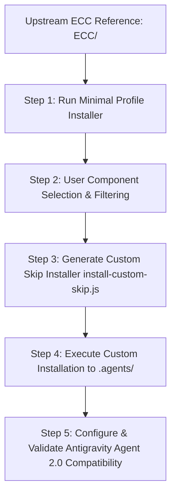

# ECC Hybrid Adapter Skill (`ecc-hybrid-adapter`)

This skill defines the canonical process for integrating the upstream **ECC Agentic Toolkit** (`ECC/`) into `agy-harness` using **Approach 4** (Hybrid Minimal Profile + Selective Custom Installer + Native `.agents/` Adapter).

---

## 1. Overview of Approach 4 Architecture



---

## 2. Execution Steps

### Step 1: Upstream Manifest Audit & Minimal Profile Run
1. Inspect available ECC profiles in `ECC/manifests/install-profiles.json`.
2. Run the ECC minimal installer script:
   ```bash
   node ECC/scripts/install-apply.js --profile minimal --dry-run
   ```

### Step 2: Component Filtering & Selection
1. Present available skills, rules, and agents from `ECC/manifests/install-components.json` to the user.
2. Filter components relevant to `agy-harness` (e.g. `agent-harness-construction`, `agentic-os`, `codebase-onboarding`, `code-reviewer`, `security-review`).

### Step 3: Custom Skip-Installer Generation
Create a project-specific custom installer `harness/scripts/install-ecc-custom.js` that:
- Skips global system paths.
- Directs outputs strictly to `d:/dev/agy-harness/.agents/`.
- Preserves `ECC/` as an isolated, un-mutated read-only reference repository.

### Step 4: Antigravity Agent 2.0 Adaptation
1. Ensure all agent prompts use proper YAML frontmatter and forward-slash paths.
2. Adapt skill definitions to match the `SKILL.md` format expected by Antigravity IDE and `agy` CLI.
3. Validate subagent integration via `invoke_subagent`.

---

## 3. Key Constraints & Guidelines
- **Reference Isolation**: Never mutate files inside `ECC/` directly during porting.
- **Path Compliance**: Map all target directory inputs using forward slashes (`/`).
- **Read-Only Safety**: Ensure ported skills honor the `d:/CLAUDE-PROJECT/website` read-only boundary.
