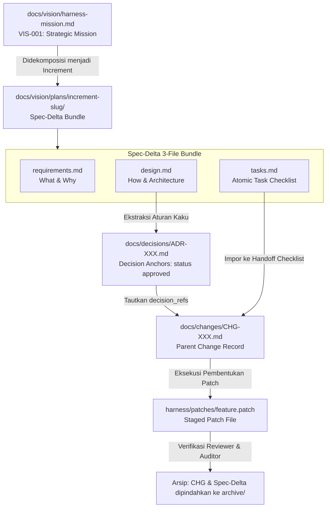

# AGY Harness (`agy-harness`)

Selamat datang di **`agy-harness`**, repositori konfigurasi mirror dan lingkungan pengujian agen (*Agentic Harness*) untuk repositori target [`website`](file:///d:/CLAUDE-PROJECT/website).

Repositori ini berfungsi sebagai pusat operasi pengembangan berbasis AI, tempat pengujian alat agen (*agentic tools*), koordinasi multi-agen, serta eksperimen metodologi rekayasa perangkat lunak modern yang diatur secara ketat oleh **Documentation-Driven Framework (DDF)**.

---

## 🎯 Tujuan Utama Repositori

Visi dan misi strategis repositori didefinisikan secara resmi dalam [docs/vision/harness-mission.md](file:///d:/dev/agy-harness/docs/vision/harness-mission.md) (`VIS-001`). Secara ringkas:

1. **Harness-Native Operating System untuk Pekerjaan Agen**: Mengintegrasikan dan menguji alat agen (*agentic toolkits*, peran, workflow, dan sidecar) di `.agents/` secara terisolasi.
2. **Kesiapan Eksperimen Pengembangan Framework**: Menyediakan sandbox terisolasi di `frameworks/` untuk mengevaluasi metodologi rekayasa perangkat lunak modern (SDD, BMAD, Agentic Design Patterns).

---

## 🛡️ Batasan Keamanan & Hak Akses

| Repositori / Direktori | Jalur Absolut | Hak Akses | Operasi yang Diizinkan |
| :--- | :--- | :--- | :--- |
| **Target Repo (`website`)** | `d:/CLAUDE-PROJECT/website` | **READ-ONLY** | Pembacaan kode, analisis AST, pencarian, dan verifikasi patch. **DILARANG keras mengedit atau menghapus file secara langsung.** |
| **Harness Repo (`agy-harness`)** | `d:/dev/agy-harness` | **READ & WRITE** | Akses penuh untuk membuat/mengubah file harness, konfigurasi agen, skrip validasi, dan pengujian. |

> [!IMPORTANT]
> Setiap perubahan yang ditujukan untuk repositori target **WAJIB** dihasilkan sebagai file patch (`.patch` atau `.diff`) yang disimpan di folder `harness/patches/`.

---

## 🛠️ Prasyarat Sistem

Untuk mengoperasikan repositori ini dan menjalankan skrip validasi governance DDF, pastikan sistem Anda memenuhi prasyarat berikut:

- **Git Bash**: Diperlukan untuk mengeksekusi skrip Bash di lingkungan Windows.
- **`yq`**: Pengolah YAML command-line (versi yang dipin & terverifikasi checksum). Diunduh otomatis oleh skrip bootstrap harness jika belum tersedia.
- **Git**: Diperlukan untuk verifikasi integritas baseline target repo.

---

## 📂 Peta Struktur Direktori Workspace

```
d:/dev/agy-harness/
├── .github/                    # Workflow CI/CD GitHub Actions
│   └── workflows/
│       └── ddf-gate.yml        # CI governance gate (menjalankan ddf-gate.sh --check-only)
├── AGENTS.md                   # Manual operasi agen & aturan governance lintas peran
├── README.md                   # Panduan pengembang manusia & onboarding DDF (file ini)
├── .agents/                    # Konfigurasi Google Antigravity workspace
│   ├── rules/                  # Aturan utama repositori (RULES.md)
│   ├── agents/                 # Definisi peran agen & subagen
│   ├── skills/                 # Spesifikasi skill kustom (agentskills.io)
│   └── workflows/              # Workflow otomatisasi agen
├── docs/                       # Dokumentasi Utama DDF (Single Source of Truth)
│   ├── README.md               # Spesifikasi arsitektur DDF & panduan skema YAML
│   ├── vision/                 # Misi strategis makro & profil target repo
│   │   ├── harness-mission.md  # Misi strategis makro (VIS-001)
│   │   ├── target-repo-profile.md # Profil teknis target repo (VIS-002)
│   │   └── plans/              # Paket spesifikasi Spec-Delta (ADR-004)
│   │       ├── _template/      # Template 3-file bundle (requirements, design, tasks)
│   │       └── archive/        # Arsip historis Spec-Delta yang selesai
│   ├── decisions/              # Decision Anchors (ADR / DR)
│   │   ├── _template.md        # Template Decision Record
│   │   ├── index.md            # Indeks terderivasi ADR aktif (Auto-generated)
│   │   └── ADR-XXX-*.md        # Catatan keputusan arsitektur immutable
│   ├── changes/                # Change Records (CHG) & DR-Patch Coupler
│   │   ├── _template.md        # Template Change Record
│   │   ├── index.md            # Indeks terderivasi CHG aktif (Auto-generated)
│   │   └── archive/            # Arsip CHG yang selesai dikerjakan
│   └── journal/                # Catatan jurnal eksekusi agen & log sesi
├── frameworks/                 # Sandbox eksperimen framework (SDD, BMAD, Custom)
├── harness/                    # Alat eksekusi harness & staging patch
│   ├── .target-baseline       # Snapshot SHA commit baseline target repo (read-only verification)
│   ├── bin/                    # Cache biner lokal yang dipin (mis. yq dengan SHA256 checksum)
│   ├── scripts/                # Skrip otomatisasi governance & validasi Bash
│   └── patches/                # File patch (.patch / .diff) untuk target repo
└── ECC/                        # Referensi pustaka upstream ECC Agentic Toolkit
```

---

## 📖 Documentation-Driven Framework (DDF) Guide

### 1. Filosofi Inti DDF

Dalam `agy-harness`, **Dokumentasi adalah Artefak Kelas Satu (First-Class Artifact)**. Kode program dianggap sebagai implementasi hilir dari niat arsitektural yang telah terdokumentasi secara sah.

- **Single Source of Truth**: Seluruh batas sistem, misi, dan keputusan arsitektural berasal dari `docs/`.
- **Cognitive Bridge Lintas Sesi**: Agen AI bekerja dalam jendela eksekusi episodik yang terbatas oleh *context window*. DDF berfungsi sebagai memori eksternal permanen agar sesi agen berikutnya dapat merekonstruksi konteks, batasan, dan alasan keputusan tanpa terjadi penyimpangan (*architectural drift*).
- **Pemisahan Skema Ganda**: Metadata menggunakan YAML frontmatter kaku untuk pemindaian mesin yang deterministik, sementara isi dokumen menggunakan Markdown bebas untuk penalaran teknis manusia dan LLM.

---

### 2. Diagram Alur Siklus Dokumentasi DDF

Alur kerja DDF bergerak secara terstruktur dari pandangan strategis (*top-down*) hingga eksekusi patch kode:



---

### 3. Matriks Taksonomi Direktori `docs/`

| Direktori | Peran & Tujuan | Konvensi Penamaan | Aturan Lifecycle & Pengarsipan |
| :--- | :--- | :--- | :--- |
| `docs/` | Panduan utama DDF & spesifikasi skema YAML | `README.md` | Diperbarui secara berkelanjutan saat skema DDF berkembang. |
| `docs/vision/` | Misi strategis makro & profil target repo | `<slug>.md` | Dokumen panduan hidup; diperbarui saat ada pergeseran strategis. |
| `docs/vision/plans/` | Paket spesifikasi Spec-Delta (Rencana Teknis) | `<increment-slug>/` | Aktif selama perancangan & eksekusi; dipindahkan ke `archive/` setelah selesai. |
| `docs/vision/plans/_template/` | Template standar Spec-Delta 3-file bundle | `requirements.md`, `design.md`, `tasks.md` | Acuan standar untuk dekomposisi rencana teknis. |
| `docs/vision/plans/archive/` | Arsip historis Spec-Delta | `<increment-slug>/` | Arsip permanen read-only untuk paket spesifikasi yang selesai dikerjakan. |
| `docs/decisions/` | Decision Anchors (Aturan Arsitektur Kaku) | `ADR-XXX-<slug>.md` | **Immutable** setelah `approved`. Perubahan aturan memerlukan ADR baru yang `supersedes`. |
| `docs/changes/` | Record Perubahan Aktif & DR-Patch Coupler | `CHG-XXX-<slug>.md` | Aktif selama pengerjaan; dipindahkan ke `archive/` saat `completed`/`verified`. |
| `docs/changes/archive/` | Arsip historis Change Records | `CHG-XXX-<slug>.md` | Arsip permanen read-only untuk jejak audit perubahan. |
| `docs/journal/` | Jurnal eksekusi & log sesi agen | `YYYY-MM-DD-journal.md` | Catatan eksekusi agen yang berurutan secara kronologis. |

---

### 4. Panduan Alur Kerja Praktis Pengembang (4-Phase Workflow)

Ketika Anda ingin menambahkan fitur baru, mengubah arsitektur, atau membuat patch untuk repositori target, ikuti 4 fase alur kerja berikut.

#### 💡 Mekanisme Eksekusi Antigravity CLI
Dalam lingkungan Antigravity/Gemini CLI, eksekusi otomatisasi berbasis *slash command* mengikuti model eksekusi bertingkat:
1. **Panggilan Slash Command**: Pengguna atau agen memanggil *slash command* (misal `/ddf-spec-init`).
2. **Workflow Markdown**: Antigravity membaca definisi instruksi workflow di `.agents/workflows/<command-name>.md`.
3. **Pemicu Skrip Bash**: Workflow menginstruksikan agen untuk mengeksekusi skrip Bash pengembang (*backing script*) yang relevan di folder `harness/scripts/` menggunakan Git Bash.

---

#### Fase 1: Inisiasi Rencana Teknis & Desain (Spec-Delta Bundle)

Buat folder baru di `docs/vision/plans/<increment-slug>/` dengan menyalin 3 file template dari `docs/vision/plans/_template/`:

1. **`requirements.md`**: Menjelaskan *apa* yang dibangun dan *mengapa* (dikaitkan dengan `VIS-001`).
   ```yaml
   ---
   title: "Persyaratan Fitur X"
   doc_type: "vision"
   status: "draft"
   author: "nama-pengembang"
   created_at: "YYYY-MM-DD"
   updated_at: "YYYY-MM-DD"
   tags: ["spec", "requirements"]
   references:
     - "docs/vision/harness-mission.md"
   ---
   ```
2. **`design.md`**: Menjelaskan *bagaimana* arsitektur teknis dirancang dan bagian mana yang perlu dikristalkan menjadi ADR.
3. **`tasks.md`**: Memuat daftar tugas atomik berurutan yang siap dieksekusi.

##### 🛠️ Alat Bawaan Harness (Phase 1 Tools)

###### Governance Ambien (Rule & Skill)
| Nama Tool | Tipe | Deskripsi |
| :--- | :--- | :--- |
| **`RULES.md`** | Rule | Menetapkan aturan tata kelola workspace, batasan read-only target repo, dan kepatuhan DDF v2. |
| **`/ddf-governance`** | Skill | Menyediakan panduan standar dan kepatuhan skema DDF v2 untuk pengelolaan ADR, CHG, dan Spec-Delta. |

###### Command Aktif (Workflow & Script)
| Nama Tool | Tipe | Sintaks Slash Command | Skrip Pengembang (`.sh`) | Deskripsi |
| :--- | :--- | :--- | :--- | :--- |
| **`ddf-spec-init`** | Workflow | `/ddf-spec-init <increment-slug>` | `ddf-validate.sh` | Menginisialisasi paket Spec-Delta 3-file bundle (`requirements.md`, `design.md`, `tasks.md`) di `docs/vision/plans/<increment-slug>/`. |

##### 📝 Contoh Prompt Instruksi Agen (Use Case: `<increment-slug>`)
> Formatted using **Mission & Governance Spec Prompt Template** (*Engineered with Prompt-Architect*)

```markdown
# MISSION: Spec-Delta Increment <increment-slug> Initialization & Design Breakdown

## Context & Objectives
Misi ini bertujuan mendekomposisi kebutuhan fitur baru menjadi paket Spec-Delta 3-file bundle terstruktur di bawah `docs/vision/plans/<increment-slug>/`.

## Governance & Constraints
1. **DDF Compliance**: Gunakan skill `/ddf-governance` dan patuhi aturan pada `.agents/rules/RULES.md`.
2. **Bundle Requirement**: Buat 3 file wajib (`requirements.md`, `design.md`, `tasks.md`) dari template `docs/vision/plans/_template/`.
3. **Forward-Slash Invariant**: Seluruh jalur file dalam metadata dan dokumen WAJIB menggunakan format forward-slash (`/`).

## Subagent Delegation Strategy
1. **Spec Init (Subagent: `explorer`)**: Inisialisasi folder paket via `/ddf-spec-init <increment-slug>`.
2. **Authoring (Subagent: `builder`)**: Tulis isi `requirements.md`, `design.md` (arsitektur & calon ADR), dan `tasks.md` (checklist tugas atomik).
3. **Gate Review (Subagent: `reviewer`)**: Jalankan skrip `bash harness/scripts/ddf-validate.sh` untuk memverifikasi kelengkapan bundle.

## Execution Workflow Steps
### Step 1: Inisialisasi Spec Bundle
Jalankan `/ddf-spec-init <increment-slug>` untuk menduplikasi template ke `docs/vision/plans/<increment-slug>/`.
### Step 2: Penyusunan Dokumen Spec
Isi `requirements.md`, `design.md`, dan `tasks.md` secara terperinci.

## Verification & Final Audit
1. Jalankan `bash harness/scripts/ddf-validate.sh`.
2. Pastikan validator mengembalikan status pass 100% tanpa peringatan kelengkapan bundle.
```

---

#### Fase 2: Validasi & Gate Arsitektur (Decision Gate & Invariant Locking)

Jika rancangan di `design.md` menghasilkan aturan kaku (*invariants*) yang wajib dipatuhi sistem di masa depan, buat dokumen ADR baru di `docs/decisions/ADR-XXX-<slug>.md` (tentukan ID `ADR-XXX` berikutnya via scan `docs/decisions/`):

```yaml
---
decision_id: "ADR-XXX"        # Tentukan ID ADR berikutnya via scan docs/decisions/
status: "draft"            # Ubah ke "approved" setelah disetujui
supersedes: null
goal: "Deskripsi ringkas tujuan arsitektural"
affected_scope:
  - "docs/"
  - "harness/scripts/"
invariants:
  - "Aturan kaku 1 yang ditetapkan oleh keputusan ini."
  - "Aturan kaku 2 yang ditetapkan oleh keputusan ini."
date: "YYYY-MM-DD"
---
```

> [!CAUTION]
> Setelah status ADR diubah menjadi `approved`, isi invariant **TIDAK BOLEH** diubah secara diam-diam. Untuk mengubah aturan yang sudah `approved`, Anda harus membuat ADR baru dan mencantumkan `supersedes: "ADR-XXX"`.

##### 🛠️ Alat Bawaan Harness (Phase 2 Tools)

###### Governance Ambien (Rule & Skill)
| Nama Tool | Tipe | Deskripsi |
| :--- | :--- | :--- |
| **`RULES.md`** | Rule | Menetapkan immutability ADR approved, batasan scope, dan kebersihan index. |
| **`/ddf-governance`** | Skill | Menyediakan spesifikasi skema frontmatter ADR dan prosedur ekstraksi invariant. |

###### Command Aktif (Workflow & Script)
| Nama Tool | Tipe | Sintaks Slash Command | Skrip Pengembang (`.sh`) | Deskripsi |
| :--- | :--- | :--- | :--- | :--- |
| **`ddf-spec-gate`** | Workflow | `/ddf-spec-gate <increment-slug>` | `ddf-validate.sh`, `ddf-index-sync.sh` | Mengaudit paket Spec-Delta, mengekstraksi invariant arsitektur menjadi ADR (`approved`), dan memperbarui indeks. |
| **`ddf-decision-gate`** | Workflow | `/ddf-decision-gate` | `ddf-gate.sh` | Gatekeeper master otomatis untuk memverifikasi sintaks frontmatter, referensi ADR, integritas target repo, dan indeks. |
| **`ddf-validate.sh`** | CLI Script | N/A | `harness/scripts/ddf-validate.sh` | Memeriksa sintaks frontmatter YAML, kelengkapan key wajib, Spec-Delta 3-file bundle, dan jaminan target repo 0-edit. |
| **`ddf-gate.sh`** | CLI Script | N/A | `harness/scripts/ddf-gate.sh` | Menjalankan seluruh pengujian gate governance DDF (linter, unit test, validasi schema, dan sinkronisasi indeks). |

##### 📝 Contoh Prompt Instruksi Agen (Use Case: `<increment-slug>`)
> Formatted using **Mission & Governance Spec Prompt Template** (*Engineered with Prompt-Architect*)

```markdown
# MISSION: Spec-Delta <increment-slug> Invariant Gate & ADR Extraction

## Context & Objectives
Misi ini bertujuan mengaudit rancangan arsitektur `<increment-slug>`, mengekstraksi aturan kaku menjadi Decision Records (tentukan nomor ID ADR berikutnya yang tersedia via scan `docs/decisions/`), dan mengunci statusnya menjadi `approved`.

## Governance & Constraints
1. **ADR Immutability**: Setelah disetujui, isi invariant pada ADR yang baru diekstraksi di `docs/decisions/` bersifat immutable.
2. **Index Purity**: Tabel `docs/decisions/index.md` HANYA boleh mencatat ADR dengan status `approved` atau `superseded`.
3. **Script Verification**: Verifikasi wajib dijalankan menggunakan Git Bash via `bash harness/scripts/ddf-gate.sh`.

## Subagent Delegation Strategy
1. **Architectural Audit (Subagent: `auditor`)**: Audit Seksi 4 `design.md` di `docs/vision/plans/<increment-slug>/`.
2. **ADR Extraction (Subagent: `builder`)**: Ekstraksi file `ADR-XXX-<slug>.md` di `docs/decisions/` (menggunakan ID ADR berikutnya yang sah) dengan `status: approved`.
3. **Index & Gate Check (Subagent: `reviewer`)**: Jalankan `/ddf-spec-gate <increment-slug>` untuk memperbarui indeks dan mengeksekusi gate.

## Execution Workflow Steps
### Step 1: Ekstraksi ADR Invariants
Buat file `ADR-XXX-<slug>.md` di `docs/decisions/` (menggunakan nomor ADR sah berikutnya) dengan frontmatter YAML valid.
### Step 2: Sinkronisasi Indeks & Master Gate
Jalankan `bash harness/scripts/ddf-index-sync.sh` dan `bash harness/scripts/ddf-gate.sh`.

## Verification & Final Audit
1. Verifikasi bahwa `docs/decisions/index.md` memuat ID ADR baru berstatus `approved`.
2. Pastikan script `ddf-gate.sh` mengembalikan exit code 0.
```

---

#### Fase 3: Pelaksanaan Task & Patch Staging (CHG Execution)

Untuk mengeksekusi tugas-tugas di `tasks.md`, buat Change Record di `docs/changes/CHG-XXX-<slug>.md` (tentukan ID `CHG-XXX` berikutnya via scan `docs/changes/`):

```yaml
---
change_id: "CHG-XXX"          # Tentukan ID CHG berikutnya via scan docs/changes/
status: "draft"            # draft -> in_progress -> completed -> verified
decision_refs: ['ADR-XXX'] # Harus merujuk pada ADR status 'approved'
spec_delta_ref: "<increment-slug>" # Wajib sejak ADR-005 Invariant 11
owner_stage: "builder"     # explorer -> builder -> reviewer -> auditor
date: "YYYY-MM-DD"
---
```

- Salin checklist task dari `tasks.md` ke dalam bagian *Handoff Checklist* pada CHG.
- Jika perubahan menargetkan repositori target [`website`](file:///d:/CLAUDE-PROJECT/website), hasilkan file patch dan simpan di `harness/patches/<feature-name>.patch`.

##### 🛠️ Alat Bawaan Harness (Phase 3 Tools)

###### Governance Ambien (Rule & Skill)
| Nama Tool | Tipe | Deskripsi |
| :--- | :--- | :--- |
| **`RULES.md`** | Rule | Menegakkan DR-Patch coupling dan batasan read-only target repo. |
| **`/ddf-governance`** | Skill | Menyediakan prosedur pengikatan CHG ke ADR approved dan pembuatan patch file. |

###### Command Aktif (Workflow & Script)
| Nama Tool | Tipe | Sintaks Slash Command | Skrip Pengembang (`.sh`) | Deskripsi |
| :--- | :--- | :--- | :--- | :--- |
| **`ddf-spec-apply`** | Workflow | `/ddf-spec-apply <increment-slug>` | `ddf-validate.sh` | Mengikat Spec-Delta aktif ke Parent CHG, mengimpor checklist tasks, mengonstruksi patch target repo di `harness/patches/`, dan menjalankan validasi. |

##### 📝 Contoh Prompt Instruksi Agen (Use Case: `<increment-slug>`)
> Formatted using **Mission & Governance Spec Prompt Template** (*Engineered with Prompt-Architect*)

```markdown
# MISSION: Spec-Delta <increment-slug> Change Execution & Patch Staging

## Context & Objectives
Misi ini bertujuan mengikat paket `<increment-slug>` ke Parent Change Record (tentukan ID `CHG-XXX` berikutnya yang valid via scan `docs/changes/`), mengeksekusi tugas implementasi, dan menyimpan patch target repo di `harness/patches/` jika ada perubahan pada repositori target.

## Governance & Constraints
1. **Target Repo Read-Only Boundary**: DILARANG keras mengedit file di `d:/CLAUDE-PROJECT/website` secara langsung. Seluruh perubahan target repo WAJIB disimpan sebagai patch di `harness/patches/<feature-name>.patch`.
2. **DR-Patch Coupling**: CHG WAJIB mencantumkan `decision_refs` yang merujuk pada ADR berstatus `approved`.
3. **Spec-Delta Reference**: CHG WAJIB mencantumkan `spec_delta_ref: "<increment-slug>"`.

## Subagent Delegation Strategy
1. **Parent CHG Binding (Subagent: `builder`)**: Buat `docs/changes/CHG-XXX-<slug>.md` (menggunakan nomor CHG sah berikutnya) dan impor checklist dari `tasks.md`.
2. **Patch Creation & Execution (Subagent: `patch-builder`)**: Buat file patch `harness/patches/<feature-name>.patch` jika menargetkan repo target, dan eksekusi tugas implementasi.
3. **Task Apply & Validation (Subagent: `reviewer`)**: Jalankan `/ddf-spec-apply <increment-slug>` untuk mengikat dan memverifikasi perubahan.

## Execution Workflow Steps
### Step 1: Eksekusi Task & Patch Staging
Jalankan `/ddf-spec-apply <increment-slug>`, selesaikan tugas, dan simpan patch di `harness/patches/` jika ada.
### Step 2: Validasi Perubahan
Jalankan `bash harness/scripts/ddf-validate.sh`.

## Verification & Final Audit
1. Verifikasi kelengkapan checklist pada `docs/changes/CHG-XXX-<slug>.md`.
2. Pastikan script `ddf-validate.sh` mengembalikan exit code 0.
```

---

#### Fase 4: Pengarsipan Mekanis & Governance Gate (Archiving & Final Audit)

Setelah seluruh tugas pada CHG selesai dikerjakan dan diverifikasi, lakukan pengarsipan mekanis untuk memindahkan paket Spec-Delta dan CHG ke direktori `archive/` serta pastikan seluruh gate governance lulus.

##### 🛠️ Alat Bawaan Harness (Phase 4 Tools)

###### Governance Ambien (Rule & Skill)
| Nama Tool | Tipe | Deskripsi |
| :--- | :--- | :--- |
| **`RULES.md`** | Rule | Menegakkan pengarsipan otomatis Spec-Delta dan integritas indeks terderivasi. |
| **`/ddf-governance`** | Skill | Menyediakan prosedur pengarsipan mekanis dan audit final governance. |

###### Command Aktif (Workflow & Script)
| Nama Tool | Tipe | Sintaks Slash Command | Skrip Pengembang (`.sh`) | Deskripsi |
| :--- | :--- | :--- | :--- | :--- |
| **`ddf-spec-archive`** | Workflow | `/ddf-spec-archive <increment-slug>` | `ddf-archive.sh`, `ddf-index-sync.sh`, `ddf-gate.sh` | Menjalankan pengarsipan mekanis otomatis untuk memindahkan Spec-Delta dan CHG selesai ke `archive/`, memperbarui indeks, dan mengeksekusi verifikasi akhir `ddf-gate.sh`. |
| **`ddf-archive.sh`** | CLI Script | N/A | `harness/scripts/ddf-archive.sh` | Memindahkan Change Record dan paket Spec-Delta yang selesai dikerjakan ke direktori `archive/`. |
| **`ddf-index-sync.sh`** | CLI Script | N/A | `harness/scripts/ddf-index-sync.sh` | Memperbarui tabel indeks terderivasi di `docs/decisions/index.md` dan `docs/changes/index.md`. |
| **`ddf-gate.sh`** | CLI Script | N/A | `harness/scripts/ddf-gate.sh` | Menjalankan seluruh pengujian gate governance DDF (linter, unit test, validasi schema, dan sinkronisasi indeks). |

##### 📝 Contoh Prompt Instruksi Agen (Use Case: `<increment-slug>`)
> Formatted using **Mission & Governance Spec Prompt Template** (*Engineered with Prompt-Architect*)

```markdown
# MISSION: Spec-Delta <increment-slug> Mechanical Archival & Governance Gate

## Context & Objectives
Misi ini bertujuan melakukan pengarsipan mekanis terhadap paket Spec-Delta `<increment-slug>` dan Parent CHG terkait yang telah selesai, serta memverifikasi kebersihan workspace via master governance gate.

## Governance & Constraints
1. **Automated Archival**: Pengarsipan WAJIB menggunakan workflow `/ddf-spec-archive <increment-slug>` atau skrip `bash harness/scripts/ddf-archive.sh`.
2. **Index Purity & Audit**: Jalankan `ddf-index-sync.sh` dan `ddf-gate.sh` untuk memastikan indeks terbarui dan workspace 100% bersih.

## Subagent Delegation Strategy
1. **Mechanical Archival (Subagent: `builder`)**: Jalankan `/ddf-spec-archive <increment-slug>` untuk memindahkan paket Spec-Delta dan CHG terkait ke `archive/`.
2. **Index Sync & Gate Check (Subagent: `auditor`)**: Eksekusi `bash harness/scripts/ddf-gate.sh` untuk verifikasi akhir.

## Execution Workflow Steps
### Step 1: Mechanical Archival
Jalankan `/ddf-spec-archive <increment-slug>` untuk memindahkan Spec-Delta dan Parent CHG ke `archive/`.
### Step 2: Final Governance Audit
Jalankan `bash harness/scripts/ddf-gate.sh`.

## Verification & Final Audit
1. Verifikasi keberadaan folder di `docs/vision/plans/archive/<increment-slug>/` dan file CHG di `docs/changes/archive/`.
2. Pastikan `ddf-gate.sh` mengembalikan exit code 0 tanpa error.
```

---

### 5. Panduan Penggunaan Tooling Script Governance (CLI Bash)

Seluruh penegakan aturan DDF dilakukan secara otomatis melalui skrip Bash di `harness/scripts/`. Jalankan skrip ini menggunakan **Git Bash** dari root repositori (`d:/dev/agy-harness`):

#### 1. Validasi Schema & Invariant (`ddf-validate.sh`)
Memeriksa sintaks YAML frontmatter, kelengkapan key wajib, validitas rujukan ADR, kelengkapan Spec-Delta 3-file bundle, dan kebersihan target repo.
```bash
# Validasi seluruh repositori
& "C:\Program Files\Git\bin\bash.exe" harness/scripts/ddf-validate.sh

# Validasi file spesifik saja
& "C:\Program Files\Git\bin\bash.exe" harness/scripts/ddf-validate.sh --file docs/decisions/ADR-004-spec-delta-increment-pipeline.md
```

#### 2. Sinkronisasi Cache Indeks (`ddf-index-sync.sh`)
Memperbarui tabel indeks terderivasi di `docs/decisions/index.md` dan `docs/changes/index.md` secara otomatis. (Indeks ADR HANYA mencatat ADR yang `approved` atau `superseded`).
```bash
& "C:\Program Files\Git\bin\bash.exe" harness/scripts/ddf-index-sync.sh
```

#### 3. Pengarsipan Otomatis (`ddf-archive.sh`)
Memindahkan Change Record (`CHG-XXX`) yang telah `completed`/`verified` ke `docs/changes/archive/` dan memindahkan folder Spec-Delta ke `docs/vision/plans/archive/`.
```bash
& "C:\Program Files\Git\bin\bash.exe" harness/scripts/ddf-archive.sh
```

#### 4. Gate Verification & Self-Test (`ddf-gate.sh` & `test-governance.sh`)
Menjalankan pengujian menyeluruh (termasuk linter shellcheck, unit test skrip governance, validasi schema, dan sinkronisasi indeks).
```bash
# Menjalankan seluruh pengujian gate governance
& "C:\Program Files\Git\bin\bash.exe" harness/scripts/ddf-gate.sh

# Pasang Git Pre-Commit Hook (menjalankan ddf-gate.sh --check-only otomatis sebelum commit)
& "C:\Program Files\Git\bin\bash.exe" harness/scripts/install-hooks.sh
```

#### 5. Automatic CI Governance Gate (`.github/workflows/ddf-gate.yml`)
Selain skrip CLI lokal, repositori ini dilengkapi dengan CI Gate GitHub Actions (`.github/workflows/ddf-gate.yml`).
- **Pemicu**: Berjalan secara otomatis pada setiap aksi `push` dan `pull_request` ke *branch* `main` / `master`.
- **Perilaku**: Menjalankan `bash harness/scripts/ddf-gate.sh --check-only` di lingkungan runner `ubuntu-latest`.
- **Fungsi**: Berfungsi sebagai lapisan penegakan (*enforcement layer*) independen yang menjamin tidak ada kode atau dokumen yang melanggar aturan DDF (seperti uncoupled patch, frontmatter invalid, atau drift baseline target) dapat terdorong ke *branch* utama, bahkan jika pre-commit hook lokal dilewati.

---

### 6. Troubleshooting & Solusi Kesalahan Umum Validasi

| Pesan Kesalahan Validasi | Penyebab Umum | Solusi Perbaikan |
| :--- | :--- | :--- |
| `Missing frontmatter delimiters (---)` | File markdown tidak diawali atau diakhiri dengan baris `---`. | Pastikan header YAML diapit oleh baris `---` di paling atas file. |
| `Missing mandatory key 'decision_id'` | Atribut frontmatter wajib tidak ditemukan pada file ADR. | Tambahkan atribut `decision_id: "ADR-XXX"` pada frontmatter. |
| `Invalid decision_ref 'ADR-XXX' - status is 'draft'` | File CHG merujuk pada ADR yang statusnya masih `draft` atau `proposed`. | Pastikan ADR pendukung sudah diaudit dan diubah statusnya menjadi `approved` sebelum dikaitkan ke CHG. |
| `Spec-Delta bundle folder is incomplete` | Folder di `docs/vision/plans/<slug>/` tidak memuat ketiga file wajib. | Pastikan folder memuat `requirements.md`, `design.md`, dan `tasks.md`. |
| `Target repo (website) has uncommitted modifications` | Terdapat perubahan langsung pada file di `d:/CLAUDE-PROJECT/website`. | Batalkan (*revert*) perubahan langsung di target repo dan pindahkan perubahan tersebut ke dalam file patch di `harness/patches/`. |
| `yq command not found` | Dependency `yq` belum terinstal pada sistem. | Jalankan `harness/scripts/ddf-validate.sh` sekali; skrip akan mengunduh binary `yq` yang terverifikasi checksum secara otomatis ke folder lokal. |
| `Target repo commit hash drift detected` | Commit SHA target repo berubah dibanding `harness/.target-baseline`. | Investigasi perubahan pada repo target `d:/CLAUDE-PROJECT/website` atau perbarui baseline via proses sah jika commit target memang sengaja diperbarui. |
| `Uncoupled patch file found` | Terdapat file `.patch` di `harness/patches/` yang tidak dirujuk secara literal oleh Change Record manapun. | Cantumkan nama file patch secara literal dalam body Change Record (`docs/changes/CHG-XXX-*.md`) yang bertanggung jawab atas patch tersebut. |
| `SHA256 checksum mismatch` | Binary `yq` yang terunduh tidak cocok dengan hash SHA256 yang dipin pada skrip bootstrap. | Hapus biner cache di `harness/bin/` dan jalankan ulang skrip validasi agar biner diunduh dan diverifikasi ulang secara otomatis. |

---

## 🚀 Panduan Ringkas untuk Kontributor Baru (Quick Start)

1. **Pahami Aturan**: Baca `AGENTS.md` untuk memahami peran agen dan `docs/README.md` untuk spesifikasi arsitektur DDF terperinci.
2. **Buat Rencana Spec-Delta**: Jika menambahkan fitur/perubahan baru, salin template dari `docs/vision/plans/_template/` ke `docs/vision/plans/nama-fitur/`.
3. **Kunci ADR jika Ada Rule Baru**: Jika ada aturan arsitektur baru, buat `ADR-XXX` di `docs/decisions/` dan ubah ke `approved` setelah disetujui.
4. **Eksekusi via CHG**: Buat `CHG-XXX` di `docs/changes/`, eksekusi kode di `agy-harness/`, dan simpan patch target repo di `harness/patches/`.
5. **Jalankan Governance Gate**: Sebelum melakukan commit atau menyelesaikan tugas, jalankan `& "C:\Program Files\Git\bin\bash.exe" harness/scripts/ddf-gate.sh` untuk memastikan seluruh aturan DDF terpenuhi.
