# Master Context Router & Guide Navigation

Selamat datang di Panduan Dokumentasi Arsitektur dan Workflow **OpenAGY / ECC Ecosystem**. Repository ini mengintegrasikan **OpenSpec Spec-Driven Development (SDD)**, **Everything-as-Code (ECC) Agentic Harness**, dan **Global Antigravity Tools & MCP Servers** ke dalam satu lingkungan pengembangan yang aman, efisien, dan terstruktur.

Dokumen ini berfungsi sebagai **Master Context Router** bagi pengembang manusia (Human Developers) dan AI Agent untuk menavigasi seluruh dokumentasi sistem secara efisien tanpa mengalami *context bloat* atau kegagalan kepatuhan arsitektur.

---

## 1. Visual Navigation Diagram (Guide Documentation Tree)

Peta navigasi berikut menggambarkan hierarki dokumentasi di dalam folder `d:/dev/agy-os/guide/` serta hubungannya dengan file SOP dan referensi sistem:

```text
d:/dev/agy-os/guide/
├── README.md                                    <-- [Anda berada di sini] Master Context Router
├── architecture/
│   ├── overview.md                              <-- 3-Layer Stack Architecture & Read-Only Target Boundaries
│   └── context-engineering.md                   <-- Token Budget (85-95%), Compaction & Memory MCP Integration
├── workflow/
│   ├── index.json                               <-- Machine-Readable Metadata Index
│   ├── 01-target-patch-management/              <-- UC01: Read-Only Target Patch Management & Per-PR Delta
│   │   ├── c1-exploration-analysis.md           <--   Phase 1: Exploration (/opsx-explore + code-explorer)
│   │   ├── c2-proposal-delta-spec.md            <--   Phase 2: Proposal & Delta Specs + HITL Gate 1
│   │   ├── c3-execution-patch-staging.md        <--   Phase 3: TDD Execution & Patch Staging in harness/patches/
│   │   ├── c4-review-verification.md            <--   Phase 4: 4-Step Spec Compliance Review + /review-pr
│   │   └── c5-delivery-archiving.md             <--   Phase 5: Spec Delta Writing + HITL Gate 2 + /opsx-sync
│   ├── 02-feature-development/                  <-- UC02: End-to-End SDD Feature Development
│   ├── 03-code-review-qa/                       <-- UC03: Multi-Agent QA & Spec Compliance Review
│   ├── 04-security-audit/                       <-- UC04: Security Review & Spec Fuzzing
│   └── 05-documentation-sync/                   <-- UC05: Documentation & Spec Freshness Sync
├── SOP/
│   ├── FOR-DEV.md                               <-- Human-in-the-Loop (HITL) Reviewer & Approval SOP
│   └── FOR-AGENT.md                             <-- AI Agent Guardrails, Patch Staging & Compliance SOP
└── research/                                    <-- Indeks Dokumen Riset Arsitektur & System Blueprint
    ├── 02a-ecc-workflow-analysis.md             <-- ECC Workflow Analysis & PR #2318
    ├── 02b-openspec-framework-analysis.md       <-- OpenSpec Framework & SDD Lifecycle
    ├── 02c-global-antigravity-mcp-analysis.md   <-- Global Antigravity MCP Integration
    ├── 03-collaboration-use-case-mapping.md     <-- Collaboration Use Case Mapping
    ├── 04-integrated-workflow-design.md         <-- Integrated Workflow Architecture Design
    └── 05-guide-structure-recommendation.md    <-- Guide Structure Recommendation & Blueprint
```

```mermaid
graph TD
    A[guide/README.md<br>Master Context Router] --> B[guide/architecture/<br>Arsitektur Sistem]
    A --> C[guide/workflow/<br>Alur Kerja Operasional]
    A --> D[guide/SOP/<br>Standard Operating Procedures]
    A --> E[guide/research/<br>Riset & Analisis Arsitektur]

    B --> B1[architecture/overview.md<br>3-Layer Stack & Read-Only Bounds]
    B --> B2[architecture/context-engineering.md<br>Token Governance & Memory MCP]

    C --> C1[workflow/01-target-patch-management/<br>UC01: Patch Staging & Delta Specs]
    C --> C2[workflow/02-feature-development/<br>UC02: Feature Dev SDD]
    C --> C3[workflow/03-code-review-qa/<br>UC03: Code Review & QA]
    C --> C4[workflow/04-security-audit/<br>UC04: Security & Spec Fuzzing]
    C --> C5[workflow/05-documentation-sync/<br>UC05: Spec Freshness Sync]

    D --> D1[SOP/FOR-DEV.md<br>HITL Approval Gates & Review]
    D --> D2[SOP/FOR-AGENT.md<br>Agent Operational Guardrails]

    E --> E1[research/02a-ecc-workflow-analysis.md<br>ECC Workflow Analysis & PR #2318]
    E --> E2[research/02b-openspec-framework-analysis.md<br>OpenSpec Framework & SDD Lifecycle]
    E --> E3[research/02c-global-antigravity-mcp-analysis.md<br>Global Antigravity MCP Integration]
    E --> E4[research/03-collaboration-use-case-mapping.md<br>Collaboration Use Case Mapping]
    E --> E5[research/04-integrated-workflow-design.md<br>Integrated Workflow Architecture Design]
    E --> E6[research/05-guide-structure-recommendation.md<br>Guide Structure Recommendation & Blueprint]
```



---

## 2. Task Mapping Table ("Saya ingin X -> Baca Y")

Gunakan tabel pemetaan berikut untuk menemukan dokumen referensi yang tepat berdasarkan kebutuhan tugas Anda:

| Kebutuhan Tugas / Pertanyaan (Intensi) | Dokumen Tujuan (Baca Y) | Komponen & Workflow Terkait |
|:---|:---|:---|
| **Memahami Arsitektur 3-Layer Stack** (OpenSpec + ECC + MCP) | `d:/dev/agy-os/guide/architecture/overview.md` | Layer 1 SDD, Layer 2 Agentic Harness, Layer 3 MCP |
| **Aturan Read-Only Repo Target & Staging Patch** | `d:/dev/agy-os/guide/architecture/overview.md` | Read-only `website/`, Staging patch di `harness/patches/` |
| **Manajemen Token Budget (85-95%) & Compaction** | `d:/dev/agy-os/guide/architecture/context-engineering.md` | Token governance, `BRIEFING.md` archiving, Skill caps |
| **Integrasi Memory MCP & Retrieval Semantik** | `d:/dev/agy-os/guide/architecture/context-engineering.md` | Memory MCP Knowledge Graph, Context7 doc resolution |
| **Mengelola Perubahan pada Repo Read-Only (UC01)** | `d:/dev/agy-os/guide/workflow/01-target-patch-management/c1-exploration-analysis.md` | `/opsx-explore`, `code-explorer`, `spec-miner` |
| **Membuat Proposal & Delta Spec (ADDED/MODIFIED/REMOVED)** | `d:/dev/agy-os/guide/workflow/01-target-patch-management/c2-proposal-delta-spec.md` | `/opsx-propose`, `planner`, `spec-delta-writer` |
| **Mengirim Patch & Eksekusi TDD di Staging** | `d:/dev/agy-os/guide/workflow/01-target-patch-management/c3-execution-patch-staging.md` | `/opsx-apply`, `spec-to-test`, `tdd-guide`, `harness/patches/` |
| **Verifikasi 4-Step Spec Compliance & Review Code** | `d:/dev/agy-os/guide/workflow/01-target-patch-management/c4-review-verification.md` | `code-reviewer`, `security-reviewer`, `/review-pr` |
| **SOP Pengembang Manusia (HITL Approval Gates)** | `d:/dev/agy-os/guide/SOP/FOR-DEV.md` | Gate 1 Proposal Review, Gate 2 Patch & Diff Approval |
| **SOP Operational Guardrails untuk AI Agent** | `d:/dev/agy-os/guide/SOP/FOR-AGENT.md` | Delegation Completion Contract, Forward-slash paths, Patch-only rule |
| **Riset Workflow ECC & PR #2318** | `d:/dev/agy-os/guide/research/02a-ecc-workflow-analysis.md` | ECC Workflow Analysis & PR #2318 |
| **Riset Framework OpenSpec & SDD Lifecycle** | `d:/dev/agy-os/guide/research/02b-openspec-framework-analysis.md` | OpenSpec Framework & SDD Lifecycle |
| **Riset Integrasi Global Antigravity MCP** | `d:/dev/agy-os/guide/research/02c-global-antigravity-mcp-analysis.md` | Global Antigravity MCP Integration |
| **Pemetaan Use Case Kolaborasi Human-Agent** | `d:/dev/agy-os/guide/research/03-collaboration-use-case-mapping.md` | Collaboration Use Case Mapping |
| **Desain Arsitektur Workflow Terintegrasi** | `d:/dev/agy-os/guide/research/04-integrated-workflow-design.md` | Integrated Workflow Architecture Design |
| **Rekomendasi Struktur Guide & Blueprint** | `d:/dev/agy-os/guide/research/05-guide-structure-recommendation.md` | Guide Structure Recommendation & Blueprint |

---

## 3. Progressive Disclosure Guidelines

Prinsip **Progressive Disclosure** mengatur bagaimana pengembang manusia dan AI Agent membaca dokumentasi secara bertahap untuk menjaga efisiensi context window dan mencegah kelebihan beban informasi (*context bloat*).

### 3.1 Panduan untuk AI Agent Reader

1. **Top-Down Lazy Loading**: 
   - Jangan pernah membaca seluruh direktori `guide/` sekaligus dalam satu tool call.
   - Mulai dengan membaca `guide/README.md` (file ini) untuk mengidentifikasi file spesifik yang dibutuhkan.
   - Jalankan `view_file` hanya pada file tujuan yang relevan dengan tugas aktif.

2. **Skill & Reference File Boundaries**:
   - Instruction body pada file `SKILL.md` dibatasi maksimal **500 baris**.
   - Dokumen referensi pendukung di dalam `references/*.md` atau `assets/` hanya dibaca ketika instruksi utama meminta pendalaman materi.

3. **Briefing & Progress Compaction**:
   - File `BRIEFING.md` di workspace agent dipertahankan maksimal **100 baris**.
   - Komponen append-only (🔒 `My Identity` dan 🔒 `Key Constraints`) tidak boleh dihapus atau di-overwrite.
   - Update liveness heartbeat dicatat di `progress.md` secara bertahap tanpa memasukkan log mentah yang panjang ke dalam konteks percakapan.

### 3.2 Panduan untuk Human Developer Reader

1. **Entry Point berdasarkan Peran**:
   - **Reviewer / Technical Lead**: Mulai dari `guide/SOP/FOR-DEV.md` untuk memahami titik persetujuan (Human-in-the-Loop Gates) dan kriteria penerimaan patch.
   - **System Architect**: Mulai dari `guide/architecture/overview.md` dan `guide/architecture/context-engineering.md`.
   - **Contributor / Feature Implementer**: Ikuti alur yang dijelaskan dalam `guide/workflow/01-target-patch-management/`.

2. **Navigasi Berbasis Task**:
   - Gunakan **Task Mapping Table** di atas untuk langsung melompat ke panduan yang dibutuhkan sesuai konteks pekerjaan harian.

---

## 4. Research Artifacts Reference

Berikut adalah indeks lengkap 6 dokumen riset dan analisis arsitektur yang berlokasi di `d:/dev/agy-os/guide/research/`:

- **`guide/research/02a-ecc-workflow-analysis.md`** (`d:/dev/agy-os/guide/research/02a-ecc-workflow-analysis.md`)
  - **Judul / Topik**: ECC Workflow Analysis & PR #2318
  - **Deskripsi**: Analisis arsitektur workflow Everything-as-Code (ECC), integrasi subagent, dan evaluasi PR #2318.
- **`guide/research/02b-openspec-framework-analysis.md`** (`d:/dev/agy-os/guide/research/02b-openspec-framework-analysis.md`)
  - **Judul / Topik**: OpenSpec Framework & SDD Lifecycle
  - **Deskripsi**: Pembahasan framework OpenSpec dan siklus hidup Spec-Driven Development (SDD) untuk pengelolaan delta spec.
- **`guide/research/02c-global-antigravity-mcp-analysis.md`** (`d:/dev/agy-os/guide/research/02c-global-antigravity-mcp-analysis.md`)
  - **Judul / Topik**: Global Antigravity MCP Integration
  - **Deskripsi**: Analisis integrasi platform Antigravity dengan Model Context Protocol (MCP) server dan Context7 documentation resolution.
- **`guide/research/03-collaboration-use-case-mapping.md`** (`d:/dev/agy-os/guide/research/03-collaboration-use-case-mapping.md`)
  - **Judul / Topik**: Collaboration Use Case Mapping
  - **Deskripsi**: Pemetaan alur dan skenario kolaborasi antara pengembang manusia (Human-in-the-Loop) dan AI Agent squads.
- **`guide/research/04-integrated-workflow-design.md`** (`d:/dev/agy-os/guide/research/04-integrated-workflow-design.md`)
  - **Judul / Topik**: Integrated Workflow Architecture Design
  - **Deskripsi**: Desain arsitektur workflow terintegrasi yang menghubungkan SDD, harness staging, dan QA pipeline.
- **`guide/research/05-guide-structure-recommendation.md`** (`d:/dev/agy-os/guide/research/05-guide-structure-recommendation.md`)
  - **Judul / Topik**: Guide Structure Recommendation & Blueprint
  - **Deskripsi**: Rekomendasi struktur dan blueprint dokumentasi panduan sistem OpenAGY.

---

## 5. Standar Jalur File (Forward-Slash Invariant)

Seluruh instruksi, dokumen, skrip, dan metadata di dalam repository ini **WAJIB** menggunakan format *forward-slash* (`/`), seperti `d:/dev/agy-os/guide/architecture/overview.md`. Penggunaan Windows backslash dilarang keras untuk mencegah kegagalan lintas platform, regex parsing error, dan masalah pencocokan jalur tool.

