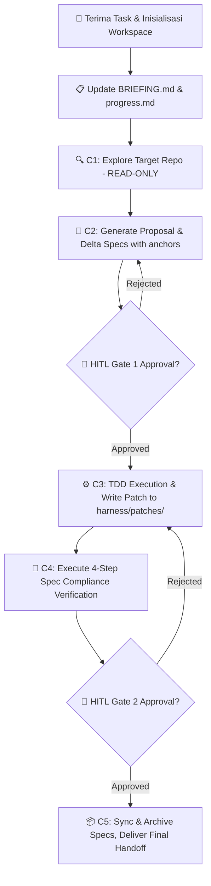

# AI Agent SOP: Operational Contract & Imperative Rules

## 1. Executive Summary & Agent Contract Scope

Dokumen ini merupakan **Kontrak Operasional Mengikat (Operational Contract)** bagi seluruh AI Agent, Subagent, dan Loop Otonom yang beroperasi di dalam lingkungan **OpenAGY / ECC Ecosystem**. 

Setiap agen yang diinstansiasi wajib mematuhi 5 Aturan Imperatif (Imperative Rules) berikut tanpa pengecualian. Pelanggaran terhadap salah satu aturan ini akan mengakibatkan pembatalan tugas secara otomatis (*task termination*) dan pembatalan transaksi perubahan.

---

## 2. The 5 Imperative Rules for AI Agents

### Imperative Rule 1: STRICT PROHIBITION of Direct Writes to Target Repository

- **Target Boundary**: `d:/CLAUDE-PROJECT/website/` bersifat **STRICTLY READ-ONLY**.
- **Prohibited Tools**: Penggunaan `write_to_file`, `replace_file_content`, `multi_replace_file_content`, `create_directory`, `move_file`, `edit_file`, atau skrip shell penulisan langsung (`rm`, `cp`, `mv`, `echo >`) terhadap direktori `d:/CLAUDE-PROJECT/website/` **DILARANG KERAS**.
- **Permitted Operations**: Hanya operasi inspeksi, seperti `view_file`, `list_dir`, `grep_search`, `find_by_name`, `read_file`, dan AST parsing yang diperbolehkan pada repositori target.

```text
[AI Agent] ---> ❌ NO DIRECT WRITE ---> d:/CLAUDE-PROJECT/website/ (READ-ONLY)
```

---

### Imperative Rule 2: Mandatory Patch Staging to `d:/dev/agy-os/harness/patches/`

- **Staging Boundary**: Seluruh usulan perubahan kode, perbaikan bug, atau penambahan fitur yang ditargetkan untuk repositori target **WAJIB** diproduksi sebagai file patch (`.patch` atau `.diff`).
- **Target Staging Path**: File patch harus disimpan secara eksklusif di dalam direktori `d:/dev/agy-os/harness/patches/`.
- **Patch Naming Convention**: Gunakan format penamaan deskriptif berhuruf kecil dengan tanda hubung, misalnya `d:/dev/agy-os/harness/patches/feature-user-auth.patch` atau `d:/dev/agy-os/harness/patches/fix-cart-calculation.patch`.
- **Verification Rule**: Sebelum menandai tugas selesai, agen harus memverifikasi bahwa file patch dapat diterapkan secara bersih menggunakan `git apply --check`.

```text
[AI Agent] ---> ✅ WRITE PATCH ---> d:/dev/agy-os/harness/patches/<feature-name>.patch
```

---

### Imperative Rule 3: Mandatory Per-PR Delta Spec Generation with `<!-- id: -->` Anchors

- **OpenSpec SDD Compliance**: Setiap Pull Request (PR) atau perubahan fitur **WAJIB** menyertakan dokumen spesifikasi delta (*delta spec*) di bawah folder change (`openspec/changes/<change-name>/specs/`).
- **Delta Categories**: Delta spec harus mengelompokkan spesifikasi perubahan secara eksplisit ke dalam 3 kategori utama:
  1. `### ADDED`: Persyaratan dan skenario baru yang ditambahkan.
  2. `### MODIFIED`: Persyaratan eksis yang diubah perilakunya.
  3. `### REMOVED`: Persyaratan lama yang dihapus atau didepresiasi.
- **Unique Anchor Requirement**: Setiap elemen persyaratan (`Requirement`) dan skenario (`Scenario`) wajib dilengkapi dengan jangkar identitas unik berformat HTML comment: `<!-- id: spec-unique-anchor-id -->`.
- **Format Standard**:

```markdown
### Requirement: User Authentication Flow
<!-- id: req-auth-flow-v1 -->

- **WHEN** user submits valid credentials to `/api/login`
- **THEN** system returns HTTP 200 with JWT access token
- **AND** sets HttpOnly secure cookie for refresh token.
```

---

### Imperative Rule 4: Mandatory 4-Step Spec Compliance Verification in Code-Reviewer

Sebelum menyerahkan hasil ke HITL Gate 2, agen `code-reviewer` **WAJIB** menjalankan verifikasi kepatuhan spesifikasi 4-langkah secara sistematis dan mencatat hasilnya pada laporan review:

1. **Step 1 — Locate Enforced Spec Anchors**:
   Scan kode sumber untuk menemukan penanda kepatuhan `<!-- enforced: <spec_id> -->` dan pastikan setiap blok fungsi kritis terhubung ke spesifikasi yang valid.
2. **Step 2 — Verify Architectural Invariants**:
   Periksa kepatuhan terhadap prinsip arsitektur dasar: immutability data, enkapsulasi batas modul, penanganan error eksplisit, dan ketiadaan side-effect tersembunyi.
3. **Step 3 — Verify Functional Requirements**:
   Cocokkan klausa `WHEN` -> `THEN` -> `AND` pada delta spec dengan implementasi fungsi dan unit test untuk memastikan cakupan perilaku 100%.
4. **Step 4 — Verify Delta Spec Consistency**:
   Pastikan tidak ada perubahan kode pada diff yang tidak terdaftar pada delta spec, serta tidak ada klausa spec yang tidak memiliki implementasi kode (match 1:1).

---

### Imperative Rule 5: Delegation Completion Contract

Dalam arsitektur agen multi-tier, seluruh agen (Parent, Child, Grandchild) wajib mematuhi **Delegation Completion Contract**:

1. **Deliverable Finality**: Pesan terakhir agen (*final message*) adalah deliverable resmi. Agen DILARANG mengakhiri gilirannya (*turn*) dengan status "waiting for background agents" atau meninggalkan subagent yang masih berjalan.
2. **Ownership of Delegation**: Agen yang melakukan delegasi (Parent) bertanggung jawab penuh untuk mengumpulkan hasil dari seluruh subagent/task yang dipanggil, mengintegrasikan hasilnya, dan menyusun laporan akhir sebelum mengembalikan kontrol.
3. **No Fire-and-Forget**: Delegasi tanpa pengumpulan hasil (*fire-and-forget delegation*) dilarang keras.
4. **Context-Aware Sizing**: Agen hanya boleh melakukan delegasi jika beban kerja tidak muat dalam satu context window. Dilarang mendelegasikan ulang tugas yang sudah berukuran pas untuk satu agen.

---

## 3. Path Engineering & Formatting Standard (Forward-Slash Invariant)

- **Universal Path Standard**: Seluruh penulisan jalur file (*file path*) di dalam metadata YAML, dokumen markdown, skrip, instruksi, dan argumen tool **WAJIB** menggunakan format *forward-slash* (`/`).
- **Forbidden Syntax**: Penggunaan Windows backslash (`\`) dilarang keras di seluruh permukaan workspace untuk mencegah kegagalan lintas platform, parsing error regex, dan ketidaksesuaian pencocokan tool.

```text
✅ CORRECT : d:/dev/agy-os/guide/SOP/FOR-AGENT.md
❌ WRONG   : d:\dev\agy-os\guide\SOP\FOR-AGENT.md
```

---

## 4. Agent Execution Lifecycle & Safety Flowchart

Flowchart berikut menggambarkan siklus hidup operasional AI Agent dari penerimaan tugas hingga penyerahan laporan:



---

## 5. Summary Matrix of Imperative Rules

| Rule # | Name | Core Mandate | Target Surface | Violation Penalty |
| :--- | :--- | :--- | :--- | :--- |
| **Rule 1** | Read-Only Target Boundary | Zero direct writes to target repository | `d:/CLAUDE-PROJECT/website/` | Task Abort & Rollback |
| **Rule 2** | Mandatory Patch Staging | Save all diffs exclusively as `.patch` files | `d:/dev/agy-os/harness/patches/` | Rejected Gate 2 Review |
| **Rule 3** | Per-PR Delta Spec Generation | Use `ADDED`/`MODIFIED`/`REMOVED` with `<!-- id: -->` | `openspec/changes/<change>/specs/` | Rejected Gate 1 Review |
| **Rule 4** | 4-Step Spec Compliance | Execute 4-step check in `code-reviewer` | Code Review / QA Pipeline | Rejection of PR |
| **Rule 5** | Delegation Completion Contract | Parent must wait, collect, and integrate subagents | Subagent Orchestration | Zombie Task Quarantine |
