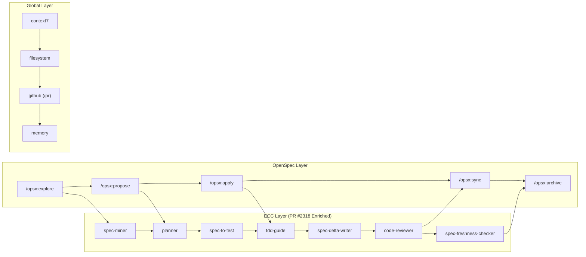

# Stage 3: Pemetaan Use Case Kolaborasi

## 1. Daftar Sumber Daya & File yang Dibaca (Audit Log)

Pemeriksaan dan sintesis dilakukan berdasarkan hasil dari dokumen riset sebelumnya serta inspeksi langsung pada file berikut:

1. `guide/research/02a-ecc-workflow-analysis.md` — Analisis workflow ECC, 37 agen (termasuk 5 agen PR #2318), dan PR tools.
2. `guide/research/02b-openspec-framework-analysis.md` — Analisis SDD OpenSpec, DAG engine, dan delta spec schema.
3. `guide/research/02c-global-antigravity-mcp-analysis.md` — Analisis 28 MCP servers aktif dan global plugins.
4. `d:/dev/agy-os/ECC/agents/spec-miner.md` — Integrasi baseline spec extraction.
5. `d:/dev/agy-os/ECC/agents/planner.md` — Integrasi tabel Spec Impact.
6. `d:/dev/agy-os/ECC/agents/code-reviewer.md` — Integrasi verifikasi spec compliance 4-langkah.
7. **GitHub PR affaan-m/ECC#2318** — Workflow per-PR `orch-spec-delta` dan agen `spec-delta-writer`.

---

## 2. Titik Temu Kolaborasi OpenSpec × ECC × Global Tools

```text
┌─────────────────────────────────────────────────────────────┐
│                    LAPISAN SPESIFIKASI                       │
│              (OpenSpec — Perencanaan & Kontrak)              │
│  explore → propose → specs → design → tasks                 │
├─────────────────────────────────────────────────────────────┤
│                    LAPISAN EKSEKUSI                          │
│         (ECC Harness — Implementasi & Verifikasi)           │
│  plan → tdd → build → test → review → commit / PR           │
├─────────────────────────────────────────────────────────────┤
│                    LAPISAN PENDUKUNG                         │
│         (Global Tools — MCP, Plugins, Builtin Skills)       │
│  context7 → memory → firecrawl → playwright → github        │
└─────────────────────────────────────────────────────────────┘
```

### Titik Integrasi Kunci

| Titik Integrasi | OpenSpec Komponen | ECC Komponen | Global Tool |
|:---|:---|:---|:---|
| **Eksplorasi Codebase** | `/opsx:explore` | `code-explorer`, `spec-miner` | `context7` (docs lookup) |
| **Perancangan Proposal** | `/opsx:propose` | `planner` (Spec Impact table), `architect` | `sequential-thinking` (reasoning) |
| **Implementasi Tasks** | `/opsx:apply` (tasks.md) | `tdd-guide`, `spec-to-test`, `build-error-resolver` | `filesystem` (read/write) |
| **Code Review & Spec Check** | Spec-based review | `code-reviewer` (4-step check), `security-reviewer` | `github` (PR creation via `/pr`) |
| **Delivery ke Target / PR** | Delta spec → patch / PR | `spec-delta-writer`, `harness/patches/` staging | `github` (PR draft) |
| **Arsip & Sync** | `/opsx:archive`, `/opsx:sync` | `doc-updater`, `spec-freshness-checker` | `memory` (knowledge graph) |

---

## 3. Use Case Operasional yang Teridentifikasi

### Use Case 01: Target Patch Management (Read-Only Protocol)
**Deskripsi**: Mengelola perubahan ke repositori target Read-Only (`d:/CLAUDE-PROJECT/website`) melalui staging patch di `harness/patches/` dan per-PR delta writing via `spec-delta-writer`.

**Alur Kolaborasi**:
1. **Explore** (OpenSpec) → Agent menganalisis codebase target menggunakan `code-explorer` (ECC) dan `context7` (MCP) tanpa memodifikasi file target.
2. **Propose** (OpenSpec) → Agent menghasilkan `proposal.md`, `specs/`, `design.md`, `tasks.md` di `openspec/changes/`.
3. **HITL Gate 1** → Developer manusia meninjau proposal.
4. **Apply** (OpenSpec + ECC) → Agent mengimplementasi tasks menggunakan `tdd-guide`, `build-error-resolver`, dan menghasilkan patch di `harness/patches/`.
5. **Delta Writing** (ECC PR #2318) → `spec-delta-writer` menganalisis `git diff` dan menyusun `openspec/deltas/<capability>/delta.md`.
6. **Review & Spec Verification** (ECC PR #2318) → `code-reviewer` memverifikasi 4 langkah spec compliance + multi-agent code/security review.
7. **HITL Gate 2** → Developer meninjau patch & PR, menerapkan ke target website.
8. **Archive & Freshness Check** (OpenSpec + ECC) → Specs di-sync ke main specs, `spec-freshness-checker` memperbarui hash commit terverifikasi.

---

### Use Case 02: Feature Development (SDD Lifecycle & Per-PR Delta)
**Deskripsi**: Pengembangan fitur baru pada `frameworks/openspec` menggunakan alur SDD lengkap terintegrasi PR (`orch-spec-delta`).

**Alur Kolaborasi**:
1. **Explore** → Investigasi requirements dan existing behavior (`spec-miner`).
2. **Propose** → Generate proposal dengan delta specs (`planner` dengan tabel Spec Impact).
3. **HITL Gate 1** → Developer meninjau plan.
4. **TDD Implementation** → `spec-to-test` membuat test skeleton, `tdd-guide` mengimplementasi kode.
5. **Delta Generation** → `spec-delta-writer` membuat delta spec dari diff.
6. **Multi-Agent Review** → `code-reviewer` (verifikasi compliance) + `security-reviewer` + `typescript-reviewer`.
7. **HITL Gate 2** → Developer konfirmasi commit / buat PR (`/pr`).
8. **Sync & Freshness Audit** → `openspec-sync-specs` + `spec-freshness-checker` di CI.

---

### Use Case 03: Code Review & Quality Assurance (Terintegrasi PR & Spec Check)
- **Trigger**: Diff lokal atau PR (`/review-pr`).
- **Multi-Agent Review**: `code-reviewer` (verifikasi compliance) + `security-reviewer` + `pr-test-analyzer`.
- **Report**: Combined findings dengan severity rating.

---

### Use Case 04: Security Audit & Compliance
- **Config & Code Scan**: `security-scan.md` + `security-reviewer`.
- **Hook Guardrails**: `hooks.json` PreToolUse events + AgentShield.

---

### Use Case 05: Documentation & Knowledge Sync
- **Update Docs & Codemaps**: `doc-updater` + `update-codemaps.md`.
- **Knowledge Graph Sync**: `memory` MCP + `/opsx-sync` + `spec-freshness-checker`.

---

## 4. Analisis Gap & Solusi Upstream ECC (PR #2318)

| Gap Awal | Solusi Upstream ECC (PR #2318) |
|:---|:---|
| **Tidak Ada Workflow Delta Spec per-PR** | `spec-delta-writer` + `orch-spec-delta` mengomparasi `git diff` terhadap baseline spec secara otomatis. |
| **Drift / Staleness Spec di CI** | `spec-freshness-checker` + `check-spec-freshness.js` memverifikasi tag `Last verified` hash commit pada CI build. |
| **Generasi Test dari Skenario Spec** | `spec-to-test` merubah skenario `WHEN/THEN/AND` menjadi test skeleton otomatis. |
| **Hardening Invariants sebelum Release** | `spec-fuzzer` menghasilkan input uji adversaria tanpa mengeksekusi kode berbahaya. |
| **Verifikasi Invariants pada Code Review** | `code-reviewer` memuat 4-step Spec Compliance Verification. |

---

## 5. Ringkasan Peta Interaksi


