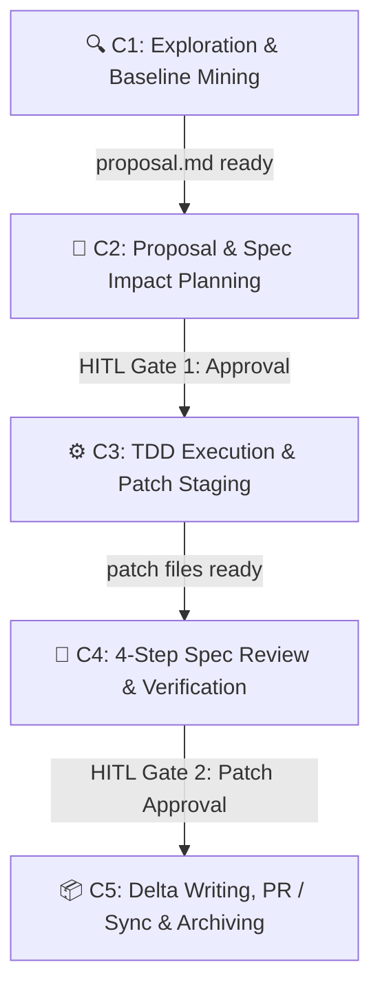

# Stage 4: Perancangan Workflow Terintegrasi

## 1. Daftar Sumber Daya & File yang Dibaca (Audit Log)

Workflow terintegrasi ini dirancang berdasarkan analisis mendalam pada file-file berikut:

1. `guide/research/03-collaboration-use-case-mapping.md` — Pemetaan use case, titik integrasi, dan solusi gap dari PR #2318.
2. `guide/research/02a-ecc-workflow-analysis.md` — Inventaris 37 agen ECC, workflows, dan PR tools.
3. `guide/research/02b-openspec-framework-analysis.md` — Spesifikasi lifecycle OPSX dan schema delta.
4. `guide/research/02c-global-antigravity-mcp-analysis.md` — Integrasi 28 MCP servers aktif.
5. `d:/dev/agy-os/ECC/agents/planner.md` — Implementasi tabel Spec Impact dan OpenSpec Awareness.
6. `d:/dev/agy-os/ECC/agents/code-reviewer.md` — Implementasi Verifikasi Spec Compliance 4-Langkah.
7. **GitHub PR affaan-m/ECC#2318** — Pipeline `orch-spec-delta` dan agen `spec-delta-writer`.

---

## 2. Use Case 01: Target Patch Management (Read-Only Protocol)

### Workflow End-to-End

### C1: Exploration & Baseline Mining
- **Trigger**: Perubahan/fitur baru diminta pada target website.
- **Commands**: `/opsx-explore`
- **Agents**: `code-explorer` (penelusuran kode), `spec-miner` (mining baseline specs jika belum ada).
- **MCP**: `context7` (docs lookup), `filesystem` (read-only scan target).
- **Constraint**: HANYA membaca target repo. DILARANG menulis.

### C2: Proposal & Spec Impact Planning
- **Trigger**: Eksplorasi selesai.
- **Commands**: `/opsx-propose <change-name>`
- **Agents**: `planner` (memuat *OpenSpec Awareness* & tabel Spec Impact), `architect`.
- **MCP**: `sequential-thinking` (structured reasoning).
- **Output**: `proposal.md`, `specs/`, `design.md`, `tasks.md`.
- **HITL Gate 1**: ✅ **WAJIB** — Developer menyetujui plan sebelum eksekusi.

### C3: TDD Execution & Patch Staging
- **Trigger**: HITL Gate 1 disetujui.
- **Commands**: `/opsx-apply`
- **Agents**: `spec-to-test` (membuat test skeleton dari scenario), `tdd-guide`, `build-error-resolver`.
- **MCP**: `filesystem` (menulis patch di `harness/patches/`), `playwright` (preview).
- **Output**: Patch files di `harness/patches/`, `tasks.md` terupdate.
- **Constraint**: Output HANYA di `harness/patches/`. DILARANG menulis langsung ke target.

### C4: 4-Step Spec Review & Verification
- **Trigger**: Semua tasks tercentang (`[x]`).
- **Agents (Paralel)**: `code-reviewer` (menjalankan *Spec Compliance Verification 4-Langkah*: 1. Find specs via `<!-- enforced: -->`, 2. Verify Invariants, 3. Verify Requirements, 4. Check Delta Compliance) + `security-reviewer` + `pr-test-analyzer`.
- **Workflows**: `code-review.md`, `/review-pr`.
- **MCP**: `github` (draf PR via `/pr` atau `/prp-pr`).
- **HITL Gate 2**: ✅ **WAJIB** — Developer meninjau patch/PR dan menerapkan ke target.

### C5: Delta Writing, Sync & Archiving
- **Trigger**: HITL Gate 2 disetujui, patch diterapkan.
- **Agents**: `spec-delta-writer` (membuat `openspec/deltas/<capability>/delta.md` dari `git diff`), `spec-freshness-checker` (memperbarui `Last verified` hash commit).
- **Commands**: `/opsx-sync` lalu `/opsx-archive`.
- **MCP**: `memory` (knowledge graph persistence).
- **Output**: Specs utama diperbarui dengan hash fresh, change dipindahkan ke `changes/archive/`.

---

## 3. Use Case 02: Feature Development (SDD Lifecycle & Per-PR Delta)

| Tahap | OpenSpec | ECC Agent / Workflow (PR #2318 Enriched) | Global Tool | HITL |
|:---|:---|:---|:---|:---|
| **C1** | `/opsx-explore` | `code-explorer`, `spec-miner` | `context7` | — |
| **C2** | `/opsx-propose` | `planner` (Spec Impact table), `architect` | `sequential-thinking` | ✅ Gate 1 |
| **C3** | `/opsx-apply` | `spec-to-test`, `tdd-guide`, `orch-spec-delta` | `filesystem`, `playwright` | — |
| **C4** | — | `code-reviewer` (4-step check), `security-reviewer`, `/review-pr` | `github` | — |
| **C5** | `/opsx-sync`, `/opsx-archive` | `spec-delta-writer`, `spec-freshness-checker`, `doc-updater` | `memory`, `github` | ✅ Gate 2 |

---

## 4. Ringkasan Pemetaan Komponen per Use Case

| Use Case | OpenSpec Skills | ECC Agents | ECC Workflows | Rules | MCP Servers | HITL Gates |
|:---|:---|:---|:---|:---|:---|:---|
| **01: Patch Mgmt** | explore, propose, apply, sync, archive | code-explorer, spec-miner, planner, tdd-guide, spec-to-test, spec-delta-writer, code-reviewer, security-reviewer, spec-freshness-checker | plan, build-fix, code-review, orch-spec-delta, review-pr | common-*, web-* | context7, filesystem, github, memory, playwright | 2 |
| **02: Feature Dev** | explore, propose, apply, update, sync, archive | planner, architect, spec-to-test, tdd-guide, spec-delta-writer, code-reviewer, security-reviewer, spec-freshness-checker | orch-add-feature, orch-spec-delta, plan, review-pr | common-*, typescript-* | context7, filesystem, github, memory | 2 |
| **03: Code Review** | — | code-reviewer (4-step check), security-reviewer, pr-test-analyzer | code-review, orch-review, review-pr | common-code-review | github | 1 |
| **04: Security** | — | security-reviewer, spec-fuzzer | security-scan | common-security | — | 1 |
| **05: Doc Sync** | sync, archive | doc-updater, spec-freshness-checker, spec-guardian | update-docs, update-codemaps | — | memory, notion | 0 |
