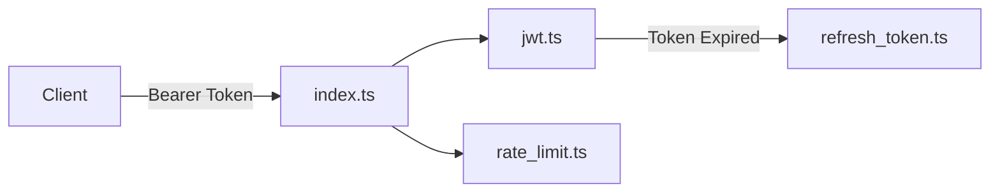

# Automated Documentation & Codemaps Sync Workflow

## 1. Overview & Architecture

Use Case 05 (**Documentation & Spec Freshness Sync**) establishes automated processes to keep project documentation, system codemaps, API contracts, and user guides strictly synchronized with code implementation changes, eliminating documentation rot and stale system diagrams.

```text
+-------------------------------------------------------------------------+
| Automated Documentation & Codemaps Sync Workflow                        |
| Commands: /update-docs, /update-codemaps                                |
| Key Subagent: doc-updater                                               |
| Scope: Architecture diagrams, API specs, codemaps, README index         |
+-------------------------------------------------------------------------+
```

---

## 2. Key Subagent & Responsibilities: `doc-updater`

The `doc-updater` subagent is responsible for inspecting codebase structural changes and synchronizing affected documentation files:

| Documentation Scope | Maintained Artifacts | Trigger Event |
|:---|:---|:---|
| **System Codemaps** | `docs/codemaps/*.md` (Module layout & entrypoint maps) | File added/moved/removed in target source tree |
| **Architecture Guides** | `guide/architecture/*.md` & `guide/README.md` | System layer or workflow contract updated |
| **API Reference Docs** | `docs/api/*.md` or OpenAPI contracts | Route handler or schema changed |
| **Master Navigation Index** | `guide/README.md` (Task Mapping Table) | New workflow document added to `guide/workflow/` |

---

## 3. Codemaps Maintenance Workflow (/update-codemaps)

Codemaps provide a lightweight ASCII/Mermaid visual representation of module dependencies and source structure. When codebase structure changes, run:

```bash
/update-codemaps
```

### Codemap Artifact Format (`docs/codemaps/auth-module.md`)
```markdown
# Auth Module Codemap

Last Updated: 2026-07-29

## Directory Structure
src/auth/
├── index.ts               # Public auth entrypoint
├── jwt.ts                 # HS256 token verification & signing
├── rate_limit.ts          # Redis-backed rate limiter (100 req/min)
└── refresh_token.ts       # Refresh token rotation store handler

## Data Flow Diagram

```

---

## 4. Documentation Sync Execution (/update-docs)

To update system guides, PRDs, and README indexes following feature completion or API refactoring:

```bash
/update-docs
```

### Execution Steps:
1. **Change Log Inspection**: `doc-updater` reviews merged PR diffs and delta specs (`openspec/changes/archive/`).
2. **Stale Doc Detection**: Scans `guide/` and `docs/` for references to modified endpoints, deprecated classes, or altered workflows.
3. **Incremental Document Editing**: Updates affected markdown files using targeted code edit tools (`replace_file_content`).
4. **Link Integrity Check**: Validates that all file path references use forward slashes (`/`) and valid `file:///` URIs.
